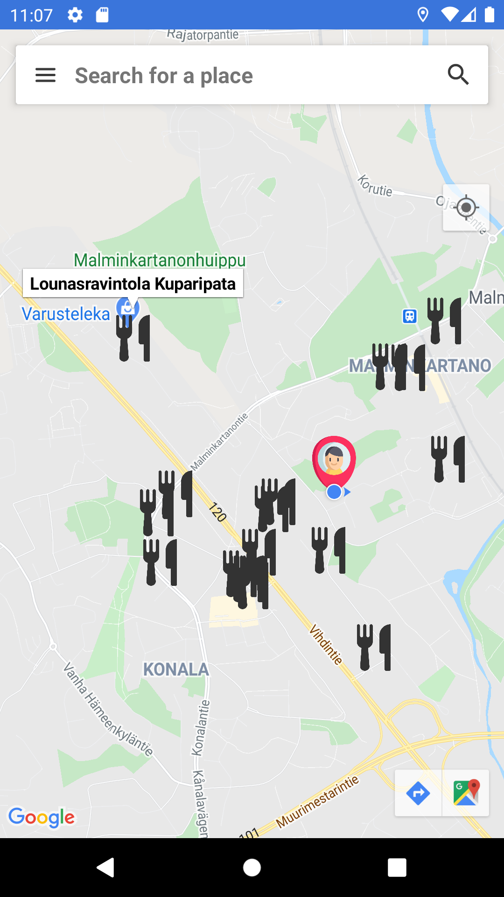
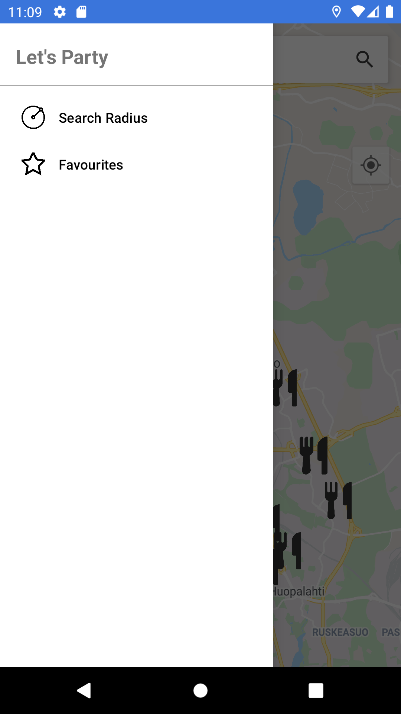
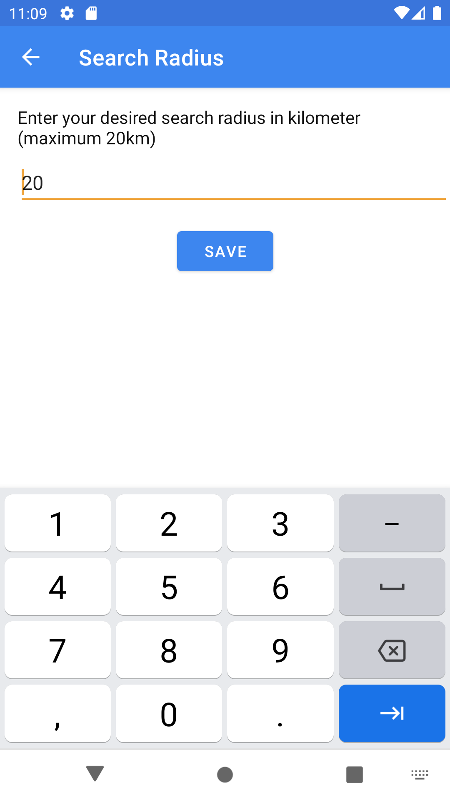

# Let's Party

---

    

---

# Description

This is the source code for Let's Party app for Android! 
Let's Party app is a **free** open-source restaurants locator application for Android where you can scan locations of nearby restaurant on a real-time map! 

# Current Version

v1.0

# Key features

- Real-time scanning nearby restaurants' locations on Google Map, 
- Showing detail information (name, address, opening time, etc.) of selected restaurants 
- Allow adjusting searching radius
- Allow save restaurants as favourites

# Dependencies

The app uses the following services:

- Google Maps API

# Team

- Amanuel Ayezabu and Nguyen Nguyen, student at Metropolia University of Applied Sciences, Finland