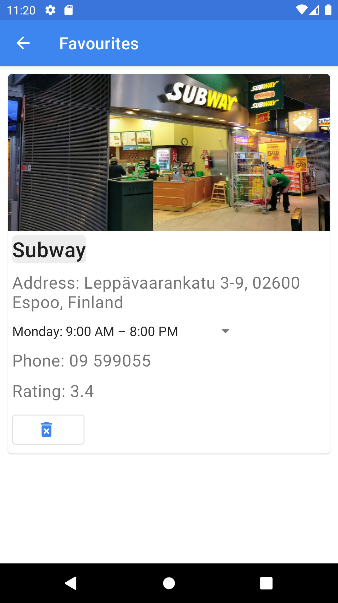

# Let's Party

---

      

---

# Description

This is the source code for Let's Party app for Android! 
Let's Party app is a **free** open-source restaurants locator application for Android where you can scan locations of nearby restaurant on a real-time map! 

# Current Version

v1.0

# Key features

- Real-time scanning nearby restaurants' locations on Google Map, 
- Showing detail information (name, address, opening time, etc.) of selected restaurants 
- Allow adjusting searching radius
- Allow save restaurants as favourites
- GPS, Humidity sensor
- Maps fragment
- Room DB/SharedPreference
- Google Map
- Retrofit
- ViewModel, LiveData
- OkHttp
- Activities

# Dependencies

The app uses the following services:

- Google Maps API
- Google Places Api
- OpenWeatherMap Api
- Material Design/Components

# Team

- Amanuel Ayezabu and Nguyen Nguyen, students at Metropolia University of Applied Sciences, Finland
